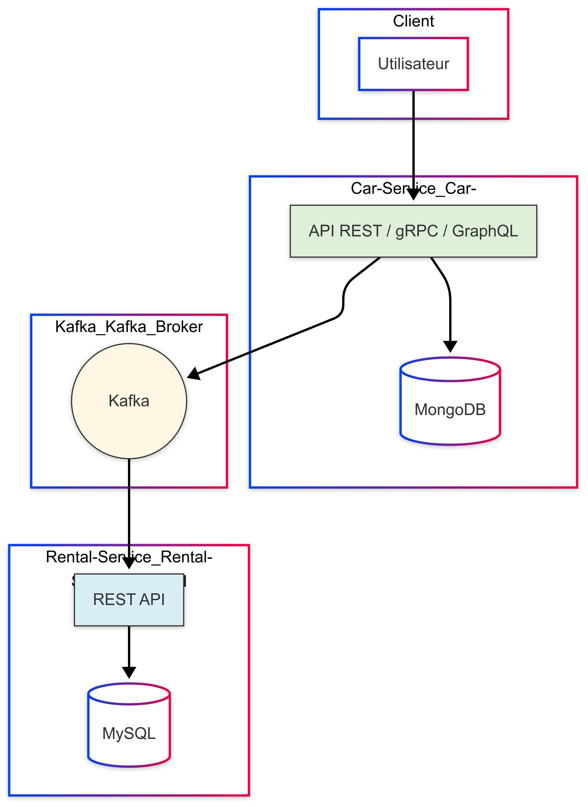

# 🚗🔧 Projet SOA - Architecture avec Car-Service et Rental-Service

Ce projet met en œuvre une architecture orientée services (SOA) composée de deux microservices principaux :  
**Car-Service** (Node.js + MongoDB) et **Rental-Service** (Laravel + MySQL), communiquant via Kafka.

---

## 🧰 Technologies utilisées

<p align="left">
  
  
  
  
  
  
  
  
  
</p>

---

## ⚙️ Prérequis

- Docker & Docker Compose
- MongoDB pour Car-Service
- MySQL pour Rental-Service

---

## 🚙 Car-Service

### 📄 Description

Service Node.js pour gérer les voitures, utilisant Mongoose + MongoDB.  
Expose des API **REST**, **gRPC**, et **GraphQL**.

### ✨ Fonctionnalités

- CRUD Voitures
- Accès via REST, gRPC, et GraphQL

### ▶️ Démarrage

```bash
docker-compose up -d car-service


***REST : http://localhost:3000/cars

***gRPC : localhost:4000

***GraphQL : http://localhost:3000/graphql

Exemple de requête GraphQL
graphql

mutation AddCar {
  addCar(brand: "tesla", year: 2025, model: "tesla", available: false) {
    id
    brand
    model
    year
    available
  }
}

🏠 Rental-Service
📄 Description
Service Laravel pour gérer les locations.
Utilise MySQL et Kafka pour la communication interservices.
▶️ Démarrage

docker-compose up -d rental-service
***REST : http://localhost:81/api/rentals
🧾 Commandes utiles

# Démarrer tous les services
docker-compose up -d

# Arrêter tous les services
docker-compose down

# Voir les logs d’un service
docker logs <nom_du_conteneur>

🧱 Structure du projet

├── car-service/          # Service Node.js + MongoDB
├── rental-service/       # Service Laravel + MySQL
├── assets/diagram.png    # Diagramme de l’architecture
└── docker-compose.yml    # Configuration des conteneurs

🧩 Architecture du projet


Ce diagramme illustre la communication entre les services via REST, gRPC, GraphQL, et Kafka.


